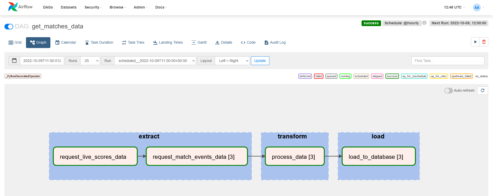
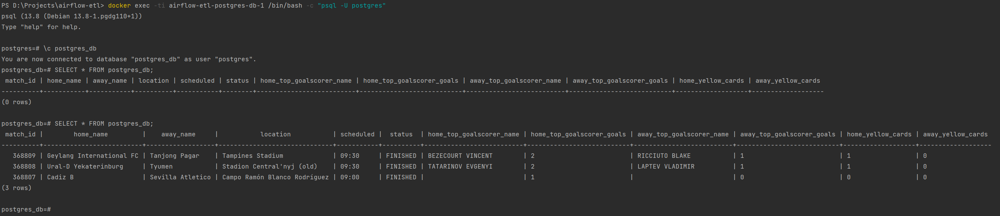

# Airflow ETL with Postgres DB connection

## Prerequisites

* Python >= 3.10
* pip >= 22.2.2
* docker
* [docker-compose](https://docs.docker.com/compose/install/) >= 2.10.2

## Installation

```bash
git clone https://github.com/Illumaria/airflow-etl.git
cd airflow-etl
```

## Usage

1. Get `API_KEY` and `API_SECRET` for https://live-score-api.com/.
2. Either set them as environment variables:

```bash
export API_KEY=<your_api_key>
export API_SECRET=<your_api_secret>
```

or put them in a `.env` file.

3. Depending on the method selected in the previous step, run one of the following commands.

```bash
docker-compose up --build -d
```
or

```bash
docker-compose --env-file <path_to_.env_file> up --build -d
```

In those cases when docker only runs with `sudo`, don't forget that `sudo` has its own environment variables, so you need to add the following to the commands above:

```bash
sudo -E docker-compose ...
```

4. Once all the services are up and running, go to [`https://localhost:8080`](https://localhost:8080) (use `airflow` for both username and password), then unpause all DAGs and run them for the first time.

5. We can check that the DAG wrote to the DB by executing the following commands:

```bash
docker exec -ti airflow-etl-postgres-db-1 /bin/bash -c "psql -U postgres"
\c postgres_db
SELECT * FROM postgres_db;
```

## Results

This is the expected result for Airflow:



And this is the expected result (before and after DAG trigger) for external Postgres DB:


